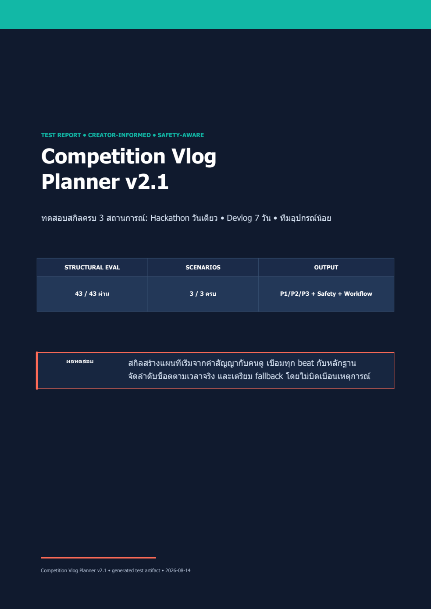
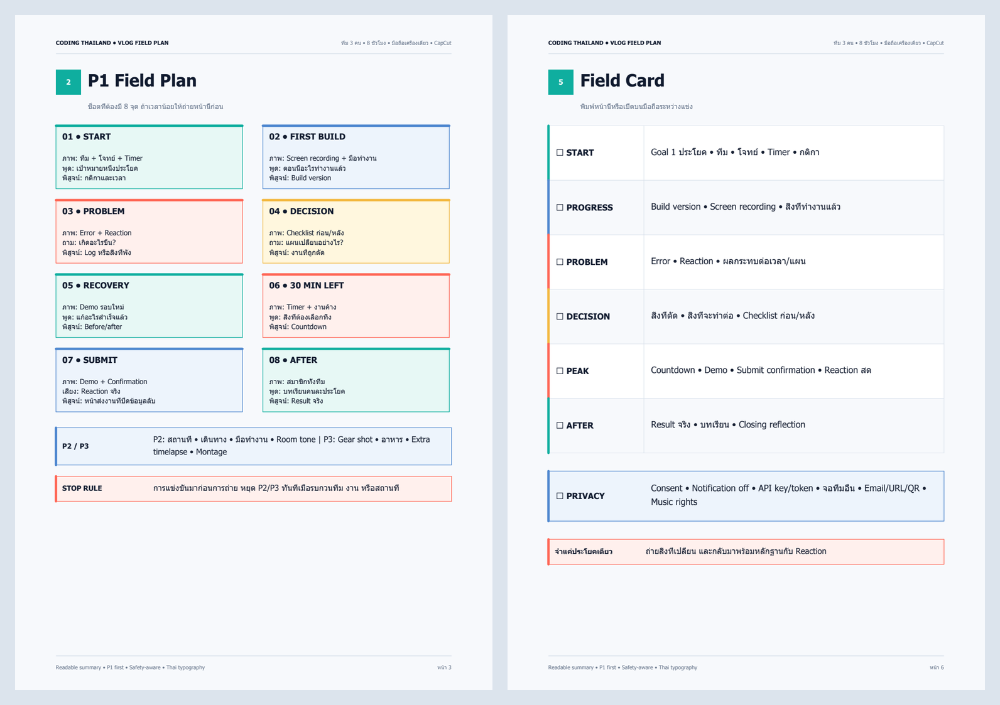
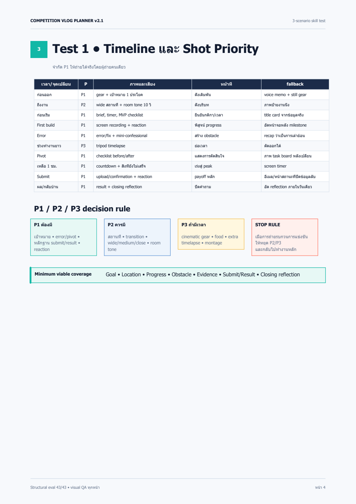
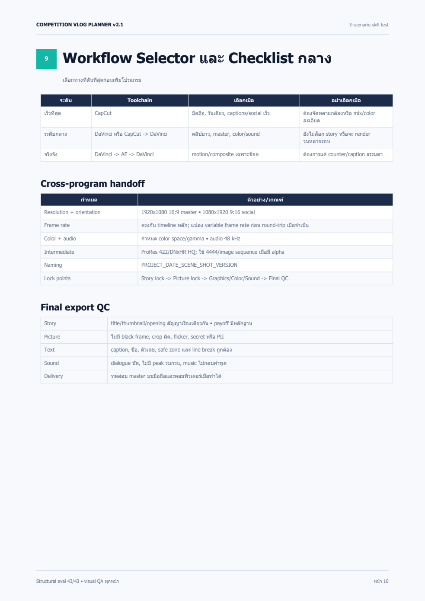

# Competition Vlog Planner

สกิลภาษาไทยสำหรับวางแผนวล็อกการแข่งขันและ devlog ตั้งแต่ packaging ก่อนถ่าย ไปจนถึงการอ่าน retention หลังเผยแพร่ เหมาะกับ hackathon, coding competition, game jam และโปรเจกต์ที่มีเดดไลน์

> เวอร์ชัน 2.2 เพิ่ม PDF ภาษาไทยแบบ readable summary/field plan พร้อม visual QA ทุกหน้า



## จุดเด่น

- วาง viewer promise, title options, thumbnail moment และ hook ก่อนถ่าย
- สร้าง story arc แบบ Before / During / After พร้อม progressive beats
- แยกช็อตเป็น P1 ต้องมี, P2 ควรมี และ P3 ถ้ามีเวลา
- จับคู่คำพูดกับ evidence B-roll เช่น error/fix, build version, timer, score และ reaction
- เตรียม fallback สำหรับแบตหมด พื้นที่เต็ม เสียงเสีย ไฟล์หาย และลืมถ่าย
- ตรวจ consent, กติกาสถานที่, API key, token, private repository และข้อมูลบนหน้าจอ
- เลือก workflow แบบ CapCut only, CapCut -> DaVinci หรือ DaVinci -> After Effects -> DaVinci
- วาง retention map, short-form derivative และ post-publish learning loop
- ส่งออกแผนเป็น PDF ภาษาไทยที่อ่านง่ายเมื่อผู้ใช้ขอ พร้อม printable field card

## ตัวอย่างผลลัพธ์

### Readable PDF



ตัวอย่าง PDF ใช้ตัวอักษรใหญ่ขึ้น แยกหนึ่งสารหลักต่อหน้า และให้ P1, emergency, privacy กับ field card หาเจอได้เร็ว

### Planning system

| Shot Priority | Workflow Selector |
|---|---|
|  |  |

ไฟล์ PDF ฉบับเต็มถูกสร้างจากชุดทดสอบและตรวจ visual layout ทุกหน้าแล้ว ผู้ใช้สามารถรัน eval ซ้ำเพื่อสร้างรายงานผลในเครื่องของตนเอง

## Quick start

ดาวน์โหลดหรือ clone repository แล้วนำโฟลเดอร์ `competition-vlog-planner` ไปไว้ในโฟลเดอร์ skills ของ Codex จากนั้นเปิด session ใหม่

เรียกใช้โดยตรง:

```text
ใช้ $competition-vlog-planner วางแผนวล็อก AI Hackathon 12 ชั่วโมง
ถ่ายคนเดียวด้วยมือถือและไมค์ไร้สาย ตัดใน CapCut
ทำ YouTube 8 นาทีและ Short 45 วินาที โทนตื่นเต้นปนตลก
```

คำขอแบบสั้นก็ใช้ได้:

```text
ช่วยทำ shot list แบบ P1/P2/P3 สำหรับ coding competition วันเดียว
```

```text
ช่วยวาง workflow DaVinci -> After Effects สำหรับ devlog 7 วัน
```

```text
ตรวจ privacy checklist ก่อนโพสต์คลิปแข่งที่มี screen recording
```

```text
สรุปแผนนี้เป็น PDF ภาษาไทยแบบอ่านง่าย มี field card สำหรับเปิดดูหน้างาน และบันทึกไว้ที่ D:\vlog-plan.pdf
```

## รูปแบบคำตอบหลัก

1. Packaging และ Hook
2. โครงเรื่องและ Progressive Beats
3. ไทม์ไลน์ถ่ายทำ
4. Shot Priority แบบ P1/P2/P3
5. Emergency และ Privacy Checklist
6. เทคนิคตัดต่อและ Retention Map
7. Workflow ตัดต่อพร้อมระดับที่เลือก
8. แผน Shorts/Reels/TikTok หรือแผนโพสต์เมื่อเกี่ยวข้อง
9. มายด์แมพเมื่อผู้ใช้ขอ

สกิลจะตอบเฉพาะส่วนที่ผู้ใช้ขอ ไม่บังคับแสดงทุกหัวข้อเสมอ

## Workflow 3 ระดับ

| ระดับ | Toolchain | เหมาะกับ |
|---|---|---|
| มือใหม่/เร็วที่สุด | CapCut | มือถือ งานวันเดียว ต้องโพสต์เร็ว |
| ระดับกลาง | CapCut -> DaVinci หรือ DaVinci อย่างเดียว | ต้องการ master ที่ควบคุม color และ sound ดีขึ้น |
| ระดับจริงจัง | DaVinci -> After Effects -> DaVinci | หลายกล้อง motion graphics หรือ compositing |

สกิลเลือก toolchain ที่สั้นที่สุดและไม่บังคับข้ามโปรแกรม ถ้าแอปเดียวทำงานได้ครบ

## Safety by design

แผนเต็มรูปแบบจะเลือก checklist ที่สัมพันธ์กับงานจริง เช่น:

- battery, storage, audio, overheating และ file backup
- venue rules, consent และพื้นที่ห้ามถ่าย
- API key, access token, password, private URL และ notification
- fallback เมื่อ footage ขาด โดยไม่จัดฉากย้อนหลังให้ดูเหมือนเหตุการณ์จริง
- master export QC, caption, safe zone และสิทธิ์เพลง

คำแนะนำเหล่านี้ไม่ใช่คำปรึกษากฎหมาย ผู้ใช้ต้องตรวจข้อกำหนดของสถานที่ การแข่งขัน และกฎหมายในพื้นที่ของตนเอง

## การทดสอบ

ชุด eval ครอบคลุม:

1. Hackathon วันเดียว ถ่ายคนเดียวด้วยมือถือ และตัด CapCut
2. Devlog โปรเจกต์ 7 วัน และทำ master ใน DaVinci Resolve
3. ทีม 3 คน อุปกรณ์น้อย และต้องแบ่งบทบาทโดยไม่รบกวนการแข่งขัน
4. ส่งออก PDF ภาษาไทยที่อ่านง่าย พร้อมกำหนด output path และ visual QA

รัน structural eval:

```powershell
python scripts/run_evals.py --skill-root . --output test-results.md
```

ตรวจโครงสร้าง skill ด้วย validator ของ `skill-creator`:

```powershell
python <path-to-skill-creator>/scripts/quick_validate.py .
```

เกณฑ์และ prompt อยู่ใน [`tests/evals.json`](tests/evals.json) สคริปต์จะคืน exit code `0` เมื่อผ่านครบ และ `1` เมื่อมีข้อใดขาด

## โครงสร้าง repository

```text
competition-vlog-planner/
├── agents/
│   └── openai.yaml
├── docs/
│   └── images/
├── references/
│   ├── creator-patterns.md
│   ├── editing-workflows.md
│   ├── field-production.md
│   └── pdf-output.md
├── scripts/
│   └── run_evals.py
├── tests/
│   └── evals.json
├── CHANGELOG.md
├── LICENSE
├── README.md
└── SKILL.md
```

## แหล่งแนวทาง

หลักการ creator-informed มาจากคู่มือแพลตฟอร์มและแหล่งต้นทาง เช่น [YouTube Help](https://support.google.com/youtube/answer/9314415), [TikTok Creative Codes](https://ads.tiktok.com/business/en-US/creative-codes), [CapCut Micro-Documentary Guide](https://www.capcut.com/create/micro-documentary-short-form-video), [Thomas Frank](https://thomasjfrank.com/creator/writing-a-script/) และ [Colin and Samir](https://www.colinandsamir.com/playbook)

ดูรายการแหล่งข้อมูล วันที่เผยแพร่ที่ระบุ และวันที่ตรวจล่าสุดใน [`references/creator-patterns.md`](references/creator-patterns.md)

สกิลใช้แนวคิดระดับสูงเพื่อวางระบบเรื่องและการถ่าย ไม่ลอกถ้อยคำ มุก ลำดับซีน หรือ visual signature ของครีเอเตอร์รายบุคคล

## ข้อจำกัด

- สกิลวางแผน แต่ไม่ได้ถ่ายหรือตัดวิดีโอแทนผู้ใช้
- retention benchmarks แตกต่างตามช่อง ผู้ชม ความยาว และแหล่ง traffic
- ฟีเจอร์และหน้าตาโปรแกรมอาจเปลี่ยนตามเวอร์ชัน
- ควรตรวจ link และข้อกำหนดแพลตฟอร์มอีกครั้งเมื่องานขึ้นกับข้อมูลปัจจุบัน

## License

เผยแพร่ภายใต้ [MIT License](LICENSE)

## English summary

Competition Vlog Planner is a Thai-language Codex skill for planning deadline-driven competition vlogs and devlogs. Version 2.2 adds optional readable PDF export, printable field cards, Thai typography guidance, visual QA, shot prioritization, field contingencies, privacy checks, tiered editing workflows, and repeatable structural evals.
